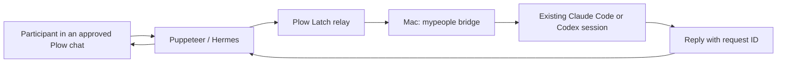

# Puppeteer

Let people in a Plow conversation talk to the Claude Code and Codex agents
already running on your Mac. The local agent keeps its session and project,
and its reply returns to the conversation that asked.

Puppeteer is a Hermes variant built on the public Plow base image. Plow Chat
carries the conversation; Plow Latch connects to the Mac; MyPlow's `mp send`
reaches the existing session. There is no custom relay or inbound Mac port.



## Install on the Mac

Install this fork's version of MyPlow:

```sh
uv tool install --force 'git+https://github.com/EnzoTironi/mypeople.git@feat/puppeteer-agent'
```

Choose a backend and authenticate it on this Mac. Start
MyPlow and confirm the target agent can answer locally. Install and sign in
to [Plow Latch](https://github.com/plow-pbc/latch) on the same Plow account
used for Puppeteer. Keep the Mac awake and Latch open during the demo.

Log in with `plow-agents login` on the Mac. Its account token stays at
`~/.config/plow/token`; it is never copied into the cloud image.

Use `mypeople status` to find the full local agent ID. Use Plow's conversation
UID for the owner DM or group you want to share. In a group, the owner
also authorizes that room in Plow so Hermes can act on requests.
Run this in the owner's Mac terminal, replacing the sample IDs:

```sh
mypeople bridge configure \
  --agent coder=sams-mac/main:eng-codex \
  --chat cht_YOUR_CONVERSATION
mypeople bridge agents --chat cht_YOUR_CONVERSATION
```

Repeat `--agent alias=full-id` and `--chat UID` to share more. All listed
conversations can ask all listed agents. Running `configure` replaces the
complete grant list. Removing a conversation or alias also revokes access
to its stored replies. To turn off sharing, remove `bridge.json` next to
MyPlow's local `queue.env`. This does not stop the coding agents.

The CLI uses MyPlow's `MYPEOPLE_CONFIG_PATH` / `MYPEOPLE_HOME` configuration.
`MYPEOPLE_BRIDGE_CONFIG` overrides the bridge configuration path.
`--token-file` overrides the local Plow account-token path. Custom homes
need matching read/write paths in Latch's approved command capabilities.

## Run the cloud agent locally

From this directory, with Docker running and `plow-agents` installed:

```sh
plow-agents login
plow-agents lines
plow-agents deploy --local --line ln_p1
```

Choose a free line. Deploy mints `plow-credentials` and starts Compose.
Add these three lines to that ignored file, then recreate the agent:

```dotenv
AGENT_ID=puppeteer
AGENT_NAME=Puppeteer
AGENT_BLURB=Talk to the Claude Code and Codex agents already running on your Mac.
```

```sh
docker compose up -d --force-recreate
docker compose logs -f
```

Text the selected number and ask which local agents are shared. Ask one to
explain its project or make a small change in a demo repository. Approve the
bridge command in Latch when it asks. Confirm the reply arrives in that same
conversation and the existing local session handled the task.

The base registers `AGENT_ID` and reports Hermes usage every five minutes.
This reports the cloud Hermes install's usage. Local Claude/Codex usage is
not added to it; report that separately by installing the Agent Index
client on the Mac for this slug as a separate install.

## Publish

Build and push a public image from this directory:

```sh
plow-agents image build ghcr.io/YOU/puppeteer:v1
plow-agents image push ghcr.io/YOU/puppeteer:v1
plow-agents profile --show
```

Make the GHCR package public. Give the Plow admin your account UID, the slug
`puppeteer`, and the exact digest reference printed by the push. The admin
enables 1-click deploy once. Later updates use:

```sh
plow-agents image push ghcr.io/YOU/puppeteer:v2 --promote puppeteer
```

Register demo media with the Agent Index client. `--video` currently takes a
YouTube video ID; `--image` takes a public HTTPS screenshot URL. Until
1-click deploy is enabled, include a public install URL pointing at this
README. GitHub PR attachments are review evidence and do not by
themselves register the Agent Index media.

```sh
python3 agent_index_client.py --register --agent puppeteer \
  --name Puppeteer \
  --blurb 'Talk to the Claude Code and Codex agents already running on your Mac.' \
  --runtime Hermes --repo https://github.com/YOU/mypeople \
  --video YOUR_YOUTUBE_ID --image https://YOUR_PUBLIC_SCREENSHOT \
  --install-url https://github.com/YOU/mypeople/tree/YOUR_COMMIT/agents/puppeteer
```

Post the repo URL, commit hash, and Agent Index ID to the hackathon
verification thread. The Plow team removes WIP after checking the MIT
license, usage, demo video, screenshot, and installation path. Building an
image or registering a listing alone does not complete that verification.

## Behavior

The local bridge accepts configured agent aliases and conversations.
It fetches the original inbound text from Plow using the Mac's own token,
checks the conversation and timestamp, and passes it to `mp send` on stdin.
It never interprets the participant's text as a shell command.

Each source message gets one persistent request ID. Concurrent retries do
not send twice. The local coding agent receives a callback command that
stores its answer under that ID. Only that target agent's `AGENT_ID` can
complete the request, and results can be read through its shared
conversation. A submission receipt is not a completed answer. Uncertain
delivery remains uncertain instead of being automatically replayed.
Requests time out after 15 minutes. The cloud agent waits on the receipt;
if its turn is interrupted, a later status question resumes the receipt.

The grant list controls this bridge. Latch still controls which Mac
operations the cloud agent may execute; its policy and approvals remain
necessary. A human who separately approves broader shell access can also
authorize operations outside this bridge. The shared local agent retains
its existing project access, so choose an appropriate agent and project.

## Verify

From the repository root:

```sh
python3 -m unittest discover -s tests -p 'test_bridge.py' -v
```

These tests exercise HTTP source verification, concurrent duplicate
delivery, restart persistence, revocation, response correlation, and
failures. They do not prove a live Plow/Latch account or phone is connected.

## License

Puppeteer's code and persona are MIT licensed under this repository's
LICENSE. The base image retains its third-party licenses, including the
Apache-2.0 Plow base and plugin. The image contains no credentials.
